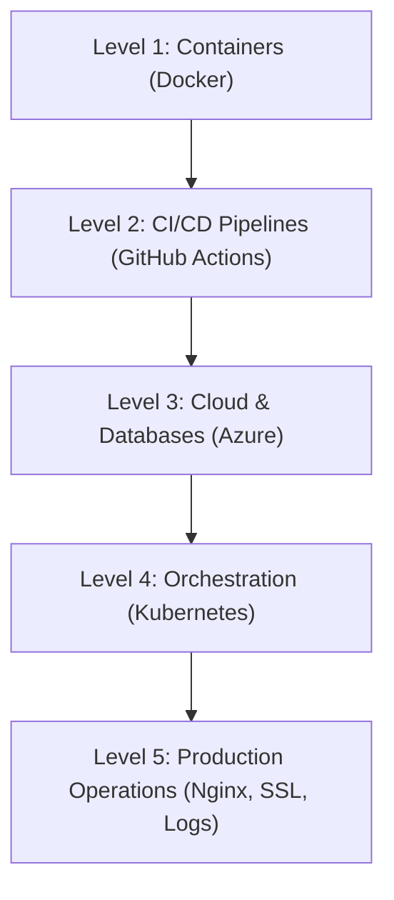

# 🛠️ Vindobona Pro: DevOps Guide & Junior DevOps Roadmap

This guide explains how to test, control, monitor, and debug your containerized applications on **Microsoft Azure**, followed by a **DevOps Roadmap** tailored for a Junior Developer looking to join top financial institutions.

---

## ☁️ Part 1: Managing Containers in Production (Microsoft Azure)

### 1. How to Test If Deployed
*   **Web API Probe**: Open the default API domain in your browser:
    `https://vindobona-api-andy-ffapb3end8fwffdm.westeurope.azurewebsites.net/api/locations`
    If it returns the JSON list of bank and ATM locations, your container is active and successfully talking to the database.
*   **Deployment Logs**: In the Azure Portal, open your Web App (`vindobona-api-andy`), navigate to **Deployment Center** -> **Logs** tab. It lists the timestamp and success status of every container image pulled from Docker Hub.

### 2. How to Control the Containers
You can manage the lifecycle of your container directly from the top menu bar of the Web App's **Overview** dashboard:
*   **Stop ⏹️**: Halts the container instantly (renders the website offline).
*   **Start ▶️**: Boots the container back up.
*   **Restart 🔄**: Stops the container, downloads the absolute latest version from Docker Hub, and boots it back up. *Always do this after pushing a bug fix.*

### 3. How to Monitor Traffic and Users
*   **Real-time Metrics**: On your Web App's **Overview** page, scroll down to see live performance charts:
    *   **Requests**: Total hits/clicks your backend is receiving.
    *   **Data In / Data Out**: Bandwidth consumption.
    *   **Http Server Errors**: Count of crashes (5xx errors) experienced by users.
*   **Log Stream**: On the left-side menu, under **Monitoring** -> **Log Stream**, you can view the live console output (`console.log`) of your Node.js application as users click and perform transactions.

### 4. How to Debug and Fix Bugs
When a bug occurs in production (e.g., in user authentication), follow this industry-standard **local-first** developer workflow:
1.  **Reproduce and Fix Locally**: Edit your code in VS Code on your laptop and test it locally until the bug is resolved.
2.  **Push to GitHub**:
    ```powershell
    git add .
    git commit -m "fix: resolve authentication security issue"
    git push origin main
    ```
3.  **Automatic Build and Deploy**: 
    *   GitHub Actions automatically builds the new fixed Docker image and uploads it to Docker Hub.
    *   Azure App Service detects the updated image on Docker Hub, pulls it, and restarts your app with **zero downtime** for your users.

---

## 📈 Part 2: DevOps Roadmap for Junior Developers (Vienna Banking Focus)

To stand out at major Austrian financial institutions like **Erste Group** or **Raiffeisen Bank International (RBI)**, you need to understand how applications are scaled, automated, and secured in production.



### 📦 Level 1: Containerization (Docker)
Containers ensure that your app runs identically on your laptop, your teammate's laptop, and the cloud.
*   **Key Concepts**: 
    *   Writing clean `Dockerfiles` (base images, working directories, copying files).
    *   Docker image layering, caching, and multi-stage builds (reducing container size).
    *   `docker-compose.yml` for running multiple services (like a backend container + a PostgreSQL container) locally.
*   **What you did in this project**: Containerized your Node.js backend using a custom Dockerfile and set up a local Postgres environment via Docker Compose.

### 🤖 Level 2: CI/CD & Automation (GitHub Actions / GitLab CI)
Automation eliminates manual errors by building and testing code on every single push.
*   **Key Concepts**:
    *   Trigger rules (`on: push: branches: [main]`).
    *   Jobs, steps, and runners (clean virtual machines that build your code).
    *   Repository Secrets: Storing credentials (like Docker Hub passwords) securely so they are never exposed in your code.
*   **What you did in this project**: Built a GitHub Actions workflow that automatically compiles and pushes your Docker images to Docker Hub on every commit.

### 💾 Level 3: Cloud Infrastructure & Managed Databases
Deploying apps to major cloud platforms (Azure, AWS, or GCP) and connecting them to managed databases.
*   **Key Concepts**:
    *   Serverless container platforms (Azure App Services, AWS ECS, GCP Cloud Run).
    *   Managed SQL databases (Azure Database for PostgreSQL, RDS) instead of manual database installations.
    *   Network isolation, VPCs, and database firewall rules (securing data so only your app can connect to it).
*   **What you did in this project**: Provisioned a PostgreSQL Flexible Server on Azure, configured its firewalls, and deployed your containerized app on Azure App Services.

### ☸️ Level 4: Orchestration (Kubernetes / K8s)
When you have hundreds of containers, you need a coordinator (orchestrator) to auto-scale, auto-heal, and load balance them.
*   **Key Concepts**:
    *   K8s architecture: Nodes (servers) and Control Plane (coordinator).
    *   **Pods**: The smallest deployable units in Kubernetes.
    *   **Deployments**: Managing replicas of your pods (e.g., "always keep 3 copies of my app running").
    *   **Services**: Exposing pods internally or to the public internet.
*   **What we will do next (Lesson 57)**: Write Kubernetes YAML deployment manifests and learn how to manage running containers.

### 🛡️ Level 5: Web Servers, Security & Observability (Nginx & SSL)
Securing and routing web traffic professionally before it reaches your containers.
*   **Key Concepts**:
    *   **Nginx**: Setting up Nginx as a Reverse Proxy to forward traffic to backend ports securely.
    *   Configuring rate-limiting on Nginx to block hacker DDoS attacks.
    *   Enforcing HTTPS (SSL/TLS certificates) using automated tools like Let's Encrypt.
    *   **Observability**: Monitoring error rates, tracking CPU usage, and setting up automated alerts (e.g., "email me if the database goes down").
*   **What we will do next (Lesson 56)**: Learn Nginx proxy configurations.
