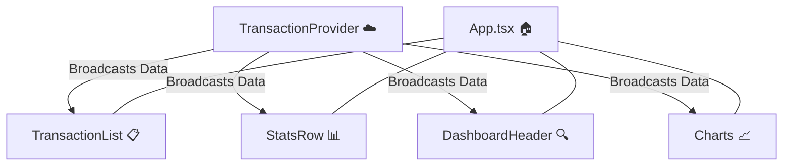

# Lesson 30: Finalizing the Global Store (The Total Move) 📊☁️

In Lesson 30, we completed the "Brain Surgery" of our app. We moved all remaining math, searching, and chart logic into the Cloud.

## 🏗️ The Final Workflow: "The Great Pruning"
1.  **Centralized Math**: We moved `totalBalance`, `income`, and `expenses` from `useTransactions` into the `TransactionProvider`.
2.  **Centralized Analytics**: We moved `pieData` and `trendData` into the Cloud.
3.  **Component Independence**: We refactored `StatsRow`, `DashboardHeader`, and the Charts to stop waiting for props and start "Subscribing" directly to the context.

---

## 📉 The Death of the Middleman (Deleted Code)
In this lesson, we deleted over 50 lines of code from `App.tsx`. 

### Why did we delete it?
*   **Redundancy**: `App.tsx` was acting like a "Postman," taking data from the Brain and delivering it to the components. 
*   **Complexity**: Passing `balance={totalBalance}` through multiple files makes it hard to change things later.
*   **The Reason**: By deleting the props and local state, we make `App.tsx` a **Layout Only** file. It only decides *where* things go, not *how* they work.

---

## 📡 The File Flow (The Global Subscription)

Instead of a "Top-Down" flow (Prop Drilling), we now use a **"Global Subscription"** model:

**How it works:**
1.  The **Provider** calculates the math once.
2.  Any component that needs data uses `const { ... } = useTransactionContext()`.
3.  The component "tunes in" to the signal. If the signal changes, the component refreshes instantly.

---

## 🧠 Why we used this code:
### `useMemo` for Math
We used `useMemo` for `totalBalance` and `pieData` because these are "expensive" calculations. We don't want the computer to do the math 60 times a second. We only want it to do the math when a transaction is added or deleted.

### Removing the `Props` Interface
By removing `interface Props` from our components, we made them **Independent**. You can now copy `StatsRow.tsx` into an entirely different project, and as long as there is a "Cloud" providing data, it will work perfectly!

---

## 🎓 Graduation Summary
You have successfully built a **Clean Architecture**. Your frontend is now modular, professional, and ready to be connected to a real database.

**Next Stop: Lesson 31 - The Backend Journey!** 🚀🤖✨🦾🏁
