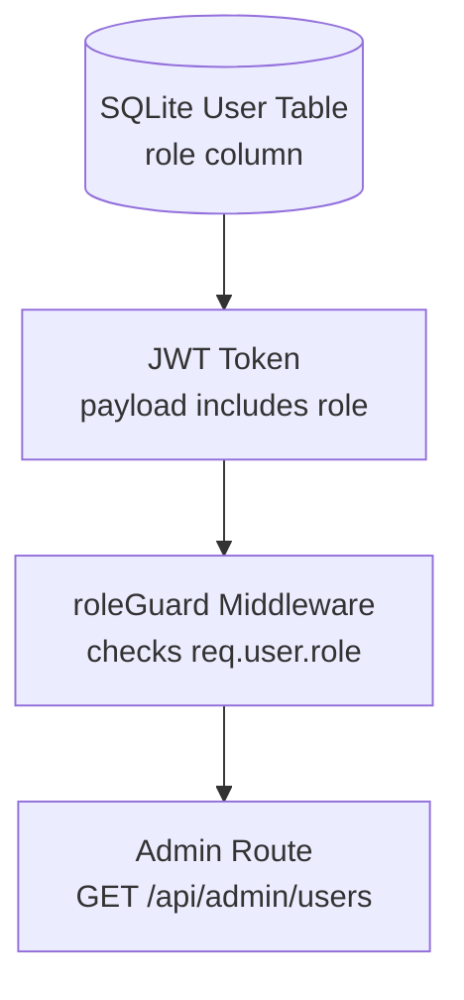

# Lesson 51: User Roles & Role-Based Access Control (RBAC) 🏦🔑🛡️

Welcome to Lesson 51! In this lesson, we introduce **Authorization** (restricting access to specific resources based on a user's privileges) to our banking application.

Up to this point, our backend only checked if a user was *authenticated* (i.e. did they have a valid JWT token). However, in a banking architecture, not all authenticated users are equal. A standard customer must never access administrative dashboards, database backups, or other users' profiles.

---

## 📍 1. Authentication vs. Authorization (Who vs. What)

It is crucial to understand the distinct roles these two security layers play:

*   **Authentication (Who are you?):** 
    *   Verifying credentials (username, hashed passwords, 2FA codes).
    *   *Analogy:* Swiping a bank card and entering a PIN at the door to enter the ATM foyer. The bank knows *exactly* who you are.
*   **Authorization (What are you allowed to do?):**
    *   Verifying privileges (Standard User vs. Auditor vs. Administrator).
    *   *Analogy:* Once inside the bank, a standard customer cannot walk behind the teller counter or open the vault door. Only staff with specific keycards (roles) are authorized to pass.

---

## 📍 2. Core Concepts of Role-Based Access Control (RBAC)

To implement RBAC in our Express application, we need to connect **three layers**:



1.  **The Database Column:** Each user must have a `role` property (e.g., `'user'` or `'admin'`). We'll add this via schema migration.
2.  **The JWT Signature:** When the user logs in, we decode their database row and embed their `role` directly into the JWT token payload. This prevents querying the database on every single incoming API request.
3.  **The Route Guard Middleware:** We write a reusable middleware (e.g., `requireRole(['admin'])`) that intercepts requests, reads the decoded token in `req.user.role`, and rejects unauthorized users with a **`403 Forbidden`** status code.

---

## 🏗️ Lesson 51 Action Plan

Tomorrow, we will implement this logic across 4 structured steps:

### 🛠️ Step 1: Database Migration
Update `backend/server/server.js` to execute an `ALTER TABLE` query. This adds the `role` column to the `users` table, defaulting existing profiles to `'user'`:
```sql
ALTER TABLE users ADD COLUMN role TEXT NOT NULL DEFAULT 'user';
```

### 🛠️ Step 2: JWT Token Payload Update
Modify [auth.js](file:///c:/Vindobona-Pro-FinTech/backend/server/routes/auth.js) across all three login/verification routes to sign the token with the user's role:
```javascript
const token = jwt.sign(
    { userId: user.id, username: user.username, role: user.role },
    process.env.JWT_SECRET,
    { expiresIn: '2h' }
);
```

### 🛠️ Step 3: Create the `roleGuard` Middleware
Write a new middleware file `backend/server/middleware/roleGuard.js` to inspect permissions:
```javascript
const requireRole = (allowedRoles) => {
    return (req, res, next) => {
        if (!req.user || !allowedRoles.includes(req.user.role)) {
            return res.status(403).json({ error: 'Access denied. Privileges required.' });
        }
        next();
    };
};
```

### 🛠️ Step 4: Implement and Mount the Admin Router
Create `backend/server/routes/admin.js` to handle administrator operations (such as listing all registered users), mount it in `server.js`, and test access permissions.
