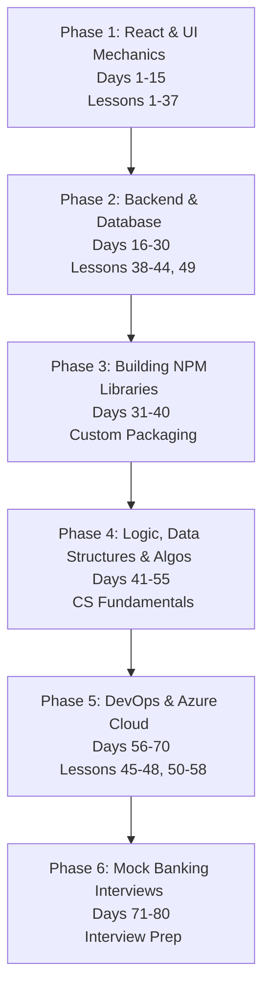

# 🚀 Vindobona Pro: Day-by-Day Revision & Mastery Roadmap
first create a todo list web app with youtub turtorial

This document outlines a **comprehensive 80-day plan** to revise, rebuild, and master full-stack software engineering, logic, algorithms, custom library creation, and DevOps with a special focus on Microsoft Azure. 

This plan is designed to be executed **after** you complete the main project curriculum (**Lessons 1–58**). The goal is to build active recall so you can write software independently without relying on AI, preparing you to succeed in banking technical interviews (Erste Group, Raiffeisen Bank, etc.).

---

## 🗺️ Roadmap & Lesson Mapping

Here is how the main roadmap lessons (**Lessons 1 to 58**) map to the days in this plan:

*   **Days 1–15 (Phase 1):** Covers **Lessons 1 to 37** (Frontend HTML, CSS, React layout, useState, useEffect hooks, and useContext).
*   **Days 16–30 (Phase 2):** Covers **Lessons 38 to 44 & Lesson 49** (Backend Node/Express APIs, SQLite databases, security middlewares, and SQL Transactions).
*   **Days 31–40 (Phase 3):** Advanced topic (not in initial lessons): **Creating & Packaging reusable libraries (NPM/UI/Helper packages)**.
*   **Days 41–55 (Phase 4):** Advanced topic (not in initial lessons): **Logic, Data Structures & Algorithms** (arrays, lists, stacks, queues, hash maps, binary search, Big O).
*   **Days 56–70 (Phase 5):** Covers **Lessons 45 to 48 & Lessons 50 to 58** (Docker containerization, Vercel deployments, custom domains, Kubernetes, role-based security, Azure cloud databases, and automated pipelines).
*   **Days 71–80 (Phase 6):** Interview Preparation (practical simulation of banking interview questions).

---

## 🗺️ Roadmap Overview

---

## 🎨 Phase 1: React & UI Mechanics (Days 1–15) - Covers Lessons 1–37
*Goal: Build UI layouts and manage React state from memory without copy-pasting.*

*   **Day 1–3: HTML5 & CSS Layout Mastery**
    *   *Focus:* Flexbox properties (`justify-content`, `align-items`, `flex-direction`) and CSS Grid layouts.
    *   *Exercise:* Build a responsive dashboard sidebar and top navbar layout using only vanilla CSS and HTML structure.
*   **Day 4–6: Reusable Visual Components**
    *   *Focus:* Passing and typing props in TypeScript, destructuring, and style isolation.
    *   *Exercise:* Create a custom `<Card />`, `<Button />`, and `<InputField />` component with hover micro-animations and dark-mode compatibility.
*   **Day 7–9: React Local State & Forms**
    *   *Focus:* `useState` triggers, binding forms (controlled inputs), and basic input validation.
    *   *Exercise:* Build a standalone transaction input form that captures receiver, amount, and category, checking for empty inputs before submitting.
*   **Day 10–12: Lifecycle & Fetching Data (`useEffect`)**
    *   *Focus:* The dependency array, cleanup functions, and avoiding infinite rendering loops.
    *   *Exercise:* Write a custom hook (`useFetch`) from memory that queries a public dummy API, handles loading indicators, and manages fetch errors.
*   **Day 13–15: Global State & Reducers (`useContext`)**
    *   *Focus:* Eliminating "prop drilling" by setting up a centralized vault for global application state.
    *   *Exercise:* Set up a `TransactionContext` with a `useReducer` action chain (`ADD_TX`, `DELETE_TX`, `SET_BALANCE`) from scratch.

---

## ⚙️ Phase 2: Backend, Database & APIs (Days 16–30) - Covers Lessons 38–44 & 49
*Goal: Master server-side architecture, HTTP routing, database management, and authentication.*

*   **Day 16–18: Node.js & Express API routing**
    *   *Focus:* Express request/response lifecycle, status codes, query params, and body parsing.
    *   *Exercise:* Create a basic Express server from a blank file, bind routes for `GET /health` and `POST /echo`, and run it.
*   **Day 19–21: SQL & SQLite Integration**
    *   *Focus:* DDL schemas (`CREATE TABLE`, `FOREIGN KEY`), constraints (`UNIQUE`, `NOT NULL`), and CRUD queries (`SELECT`, `INSERT`, `UPDATE`, `DELETE`).
    *   *Exercise:* Connect database files using the SQLite3 driver, initialize user/transaction tables, and query data using variable placeholders `?` to prevent SQL Injection.
*   **Day 22–24: JWT Authentication & Cookie Sessions**
    *   *Focus:* Hashing passwords using `bcrypt`, signing JSON Web Tokens (JWT), and saving tokens inside **HTTP-Only, Secure** cookies.
    *   *Exercise:* Build a `/register` and `/login` endpoint verifying hashed password comparisons.
*   **Day 25–27: Custom Express Middlewares**
    *   *Focus:* The `(req, res, next)` signature, error handlers, and route guards.
    *   *Exercise:* Write a custom security middleware (`authGuard`) that reads the JWT cookie, decodes the user ID, and block unauthorized requests with `401 Unauthorized`.
*   **Day 28–30: ACID Transactions & Balance Safety**
    *   *Focus:* `BEGIN TRANSACTION`, `COMMIT`, and `ROLLBACK` patterns.
    *   *Exercise:* Implement the complete funds transfer endpoint `/api/transactions/transfer` with database rollback protection.

---

## 📦 Phase 3: Building Reusable NPM Libraries (Days 31–40)
*Goal: Package code into shareable modules, setting up compilation and local registry publication.*

*   **Day 31–33: Package Structures & Exports**
    *   *Focus:* CommonJS (`module.exports`) vs. ES Modules (`export default`), `package.json` entry points (`main`, `module`, `types`).
    *   *Exercise:* Package your backend math utilities or string formatting code into a clean, standalone library directory.
*   **Day 34–36: Compilers & Bundlers**
    *   *Focus:* Setting up `tsconfig.json` for declarations (`d.ts` files) and configuring **Rollup** or **Webpack** to bundle libraries into single files.
    *   *Exercise:* Write a bundler script that compiles your React custom hooks into both ESM and CommonJS target formats.
*   **Day 37–40: Local npm Publishing & Testing**
    *   *Focus:* Running `npm pack` to check contents and setting up a local package registry (like **Verdaccio** or using `npm link`).
    *   *Exercise:* Link your custom UI library locally to your main dashboard app and import components to test rendering functionality.

---

## 🧠 Phase 4: Logic, Data Structures & Algorithms (Days 41–55)
*Goal: Solve programming logic problems and select correct data structures without guessing.*

*   **Day 41–43: Logic & Array Manipulation**
    *   *Focus:* High-order array functions (`.map()`, `.filter()`, `.reduce()`) vs. procedural loops (`for`, `while`).
    *   *Exercise:* Take a raw list of transactions and filter out duplicate entries, calculate total expenses, and group transactions by category.
*   **Day 44–46: Foundational Data Structures**
    *   *Focus:* Memory storage concepts: Arrays (sequential), Stacks (LIFO), Queues (FIFO), and Hash Maps/Objects (instant Key-Value lookups).
    *   *Exercise:* Implement a custom Stack and Queue class in TypeScript, and use a Hash Map to count transaction frequencies by category in $O(N)$ time.
*   **Day 47–50: Common Searching & Sorting Algorithms**
    *   *Focus:* Linear Search, Binary Search (sorted lists), and basic sorting algorithms (Bubble, Insertion, QuickSort).
    *   *Exercise:* Write a binary search function to locate a transaction by ID in a pre-sorted list, comparing performance logs to linear search.
*   **Day 51–55: Complexity Analysis (Big O Notation)**
    *   *Focus:* Understanding performance scaling: $O(1)$, $O(\log N)$, $O(N)$, and $O(N^2)$ running times.
    *   *Exercise:* Review code snippets, write down their Big O running complexity, and optimize a nested loop search $O(N^2)$ down to a Hash Map lookup $O(N)$.

---

## ☁️ Phase 5: DevOps & Microsoft Azure Cloud (Days 56–70) - Covers Lessons 45–48 & 50–58
*Goal: Package apps in Docker containers, orchestrate environments, and deploy secure infrastructures on Azure.*

*   **Day 56–58: Containerization with Docker**
    *   *Focus:* Container isolated layers, multi-stage builds, Alpine base images, and caching with `.dockerignore`.
    *   *Exercise:* Write a production-ready, multi-stage `Dockerfile` that builds and compiles the React frontend static files.
*   **Day 59–61: Container Orchestration**
    *   *Focus:* Docker Compose mapping, shared networks, persistent volume mounts, and environment variables.
    *   *Exercise:* Create a `docker-compose.yml` that boots your Node backend, mount the SQLite volume, and routes requests from port 80 to 5001.
*   **Day 62–64: Kubernetes Basics**
    *   *Focus:* Deployments, Pods, Services (LoadBalancer), and the `kubectl` CLI tool.
    *   *Exercise:* Write a Kubernetes YAML manifest mapping your containerized backend and exposing it on local Kubernetes clusters.
*   **Day 65–67: Microsoft Azure Provisioning**
    *   *Focus:* Resource Groups, App Services, Azure Container Registry (ACR), and Azure SQL.
    *   *Exercise:* Build an ACR resource via the Azure CLI, push your custom docker image to it, and hook it up to an Azure App Service.
*   **Day 68–70: Automated CI/CD Pipelines**
    *   *Focus:* GitHub Actions workflows, secrets management, and automated deployments.
    *   *Exercise:* Write a `.github/workflows/deploy.yml` pipeline that triggers on `git push`, runs automated tests, builds the container, and deploys to Azure App Service.

---

## 💼 Phase 6: Mock Banking Job Interviews (Days 71–80)
*Goal: Confidently communicate software concepts, pass live coding reviews, and answer system design questions.*

*   **Day 71–73: Junior Level Practice**
    *   *Focus:* Javascript closures, hoisting, React lifecycle steps, and REST API conventions.
    *   *Exercise:* Practice answering definitions out loud and writing vanilla JavaScript code on a virtual whiteboard without IDE autocompletion.
*   **Day 74–76: Mid Level & Security Practice**
    *   *Focus:* JWT authentication architecture, CORS security configuration, and database indexing.
    *   *Exercise:* Design a secure login system architecture flow showing exactly where tokens are signed, sent, stored, and checked.
*   **Day 77–80: Senior Level & System Design Practice**
    *   *Focus:* ACID Compliance, database sharding/replication, microservices data consistency, and cloud failure strategies.
    *   *Exercise:* Design a multi-service banking transaction system that can scale to 100,000 requests per second, detailing caching strategies and backup failovers.

---

## 📝 Revision Study Tips
1.  **Code on Paper or Plain Text:** During exercises, try to write the logic in a simple text editor (like Notepad) without autocompletion, copilot, or AI prompts. This forces you to think about every character you write.
2.  **Explain It Out Loud:** Use the *Feynman Technique*: pretend you are explaining how a database transaction or a React Hook works to a beginner. If you can explain it simply, you understand it.
3.  **Trace the Execution:** For every route or component, trace the execution step-by-step from when the user clicks a button to when the database records the data.
