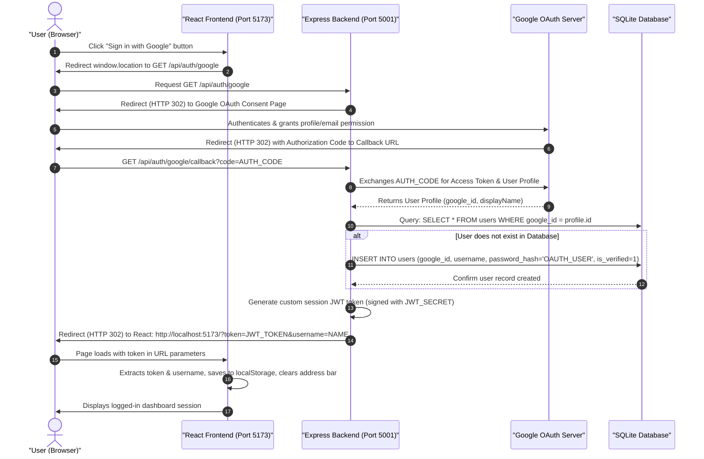

# 🔑 Google OAuth Architecture & Integration Guide (`oauth.md`)

This guide explains how **Google OAuth 2.0** is implemented and utilized across the frontend and backend of **Vindobona Pro FinTech**. It includes architectural diagrams, step-by-step plain English explanations, code highlights, and troubleshooting strategies.

---

## 🗺️ 1. Complete OAuth 2.0 Flow Diagram

Below is the step-by-step sequence diagram illustrating how the user's browser, the React frontend, the Express backend, the SQLite database, and Google's OAuth servers interact to authenticate a user.



---

## 📝 2. Step-by-Step Plain English Explanation

The Google OAuth authentication process functions in 3 main phases:

### Phase A: Directing the User to Google
1. **Frontend Initiation**: In the user interface, the user clicks the **Sign in with Google** button. The React frontend redirects the browser window directly to the backend's entry route: `/api/auth/google`.
2. **Passport Redirection**: The Express backend receives this request. Using `passport-google-oauth20`, the backend redirects the user's browser to the official Google OAuth consent screen, specifying that we require access to their `profile` and `email` scopes.

### Phase B: Verification & Database Synchronization
3. **User Consent**: The user reviews the request on Google's domain, selects their account, and clicks accept. Google's server then redirects the browser back to our backend callback route: `/api/auth/google/callback`, appending a secure temporary authorization code.
4. **Token Exchange**: Passport automatically intercepts this incoming callback request and sends the authorization code to Google's Token Server behind the scenes. In exchange, Google sends back the user's profile details (including their name and unique Google user ID).
5. **Database Lookup & Registration (Upsert)**:
   * The backend checks the SQLite database: `SELECT * FROM users WHERE google_id = ?`.
   * **If the user already exists**, we pull their record to log them in.
   * **If the user is new**, we register them in SQLite immediately. Since Google has already verified their identity, we set `is_verified = 1` and store `password_hash = 'OAUTH_USER'` (as they won't use a standard password to log in).

### Phase C: React Session Establishment
6. **JWT Generation**: The backend signs a local session **JSON Web Token (JWT)**, containing the user's ID, username, and role.
7. **Frontend Redirect**: The backend redirects the user's browser back to the React app, appending the JWT token and the username as query parameters in the URL: `http://localhost:5173/?token=JWT&username=NAME`.
8. **Token Ingestion**: The React app detects these parameters on startup. It saves the token and username into `localStorage` (so the user remains logged in on page refreshes) and then cleans the browser address bar immediately so the raw JWT token is hidden from sight.

---

## 💻 3. Code Implementations

Below are the exact code implementations handling OAuth across our stack:

### A. Frontend: Triggering the Authentication
In the login screen [AuthScreen.tsx](file:///c:/Vindobona-Pro-FinTech/src/Components/AuthScreen.tsx#L484-L487), clicking the button initiates the redirection:
```tsx
<button 
    type="button" 
    className="google-btn" 
    onClick={() => window.location.href = `${API_BASE_URL}/api/auth/google`}
>
    
    <span>Sign in with Google</span>
</button>
```

### B. Backend: Configuring Passport & Strategies
In the authentication router [auth.js](file:///c:/Vindobona-Pro-FinTech/backend/server/routes/auth.js#L26-L52), the Google Strategy defines how user profiles are processed and stored in SQLite:
```javascript
passport.use(new GoogleStrategy({
    clientID: process.env.GOOGLE_CLIENT_ID,
    clientSecret: process.env.GOOGLE_CLIENT_SECRET,
    callbackURL: process.env.GOOGLE_CALLBACK_URL || "http://localhost:5001/api/auth/google/callback"
},
async (accessToken, refreshToken, profile, done) => {
    try {
        // Search if this Google user already exists in our database
        let user = await db.get('SELECT * FROM users WHERE google_id = ?', profile.id);

        if (!user) {
            // If they don't exist, register them as a new user!
            const userId = Date.now().toString(); // Generate unique ID

            await db.run(
                'INSERT INTO users (id, username, password_hash, google_id, is_verified) VALUES (?, ?, ?, ?, ?)',
                [userId, profile.displayName, 'OAUTH_USER', profile.id, 1]
            );
            user = { id: userId, username: profile.displayName, role: 'user' };
        }

        // Pass the user details back to Passport
        return done(null, user);
    } catch (error) {
        return done(error, null);
    }
}));
```

### C. Backend: Endpoint Handlers
In [auth.js](file:///c:/Vindobona-Pro-FinTech/backend/server/routes/auth.js#L54-L74), we expose the entry endpoint and the callback endpoint:
```javascript
// 🚪 THE LOGIN REDIRECT ROUTE: Takes user from React to Google's sign-in page
router.get('/auth/google', passport.authenticate('google', { scope: ['profile', 'email'] }));

// 🤝 THE CALLBACK ROUTE: Where Google redirects the user back after signing in
router.get('/auth/google/callback',
    passport.authenticate('google', { session: false, failureRedirect: '/login' }),
    (req, res) => {
        // Google authenticated them successfully! Generate our JWT token for their session:
        const token = jwt.sign(
            { userId: req.user.id, username: req.user.username, role: req.user.role },
            process.env.JWT_SECRET,
            { expiresIn: '2h' }
        );

        // Redirect the user back to the React app and pass the token in the URL!
        const frontendUrl = process.env.FRONTEND_URL || "http://localhost:5173";
        res.redirect(`${frontendUrl}?token=${token}&username=${req.user.username}`);
    }
);
```

### D. Frontend: Ingesting the Redirect Keys
In [App.tsx](file:///c:/Vindobona-Pro-FinTech/src/App.tsx#L94-L110), a `useEffect` hook captures the URL keys on load, updates state, and purges the parameters from the address bar:
```typescript
// 🕵️‍♂️ Google Callback Reader: Scans URL parameters for login keys on startup
useEffect(() => {
  const params = new URLSearchParams(window.location.search);
  const urlToken = params.get('token');
  const urlUsername = params.get('username');

  if (urlToken && urlUsername) {
    // Save keys in browser memory
    localStorage.setItem('token', urlToken);
    localStorage.setItem('username', urlUsername);
    setToken(urlToken); // Update React state to log in
    setUsername(urlUsername);

    // Clean the address bar back to clear "http://localhost:5173/"
    window.history.replaceState({}, document.title, window.location.pathname);
  }
}, []); // Only runs once when the app boots up
```

---

## 🛠️ 4. Production Configuration & Troubleshooting

### A. Missing `client_secret` Issue
* **The Problem**: During Docker builds triggered via GitHub Actions, the `.env` file containing secrets was (rightfully) ignored due to `.gitignore`. The pushed image contained no environment variables, causing Passport.js to boot with `undefined` credentials, crashing on callback.
* **The Solution**: Environment variables are injected directly inside the **Azure App Service Settings** runtime container:
  ```powershell
  az webapp config appsettings set `
    --name vindobona-api-andy `
    --resource-group VindobonaResources `
    --settings GOOGLE_CLIENT_SECRET="GOCSPX-J_P..."
  ```

### B. "Deceptive Site Ahead" Google Safe Browsing Warning
* **The Problem**: Security scanners automatically flag new cloud endpoints (`*.azurewebsites.net`) that expose authentication paths (`/api/auth/google`) to prevent phishing schemes.
* **The Solution**:
  1. **Development Bypass**: Expand details on Chrome's red block page and click *Visit this unsafe site*.
  2. **Production Resolution**: Register a custom domain with SSL, or submit a false-positive claim directly to the **Google Safe Browsing Review Team** to whitelist the specific Azure domain.
